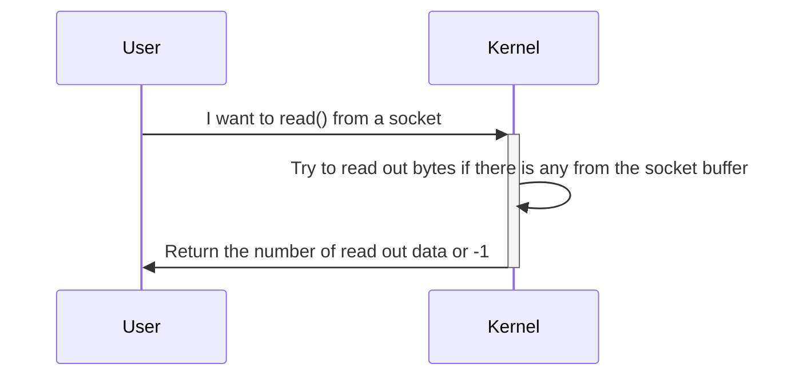

In this chapter, we are introducing the basic concept of system calls.

# TL;DR

System calls serve as an interface between the user space and the kernel space, allowing user-level applications to request services from the Linux kernel. System calls are often fixed up with library function, here is a comparison between syscalls, library functions, and user-defined functions:

| Mechanism             | In a Nutshell                                                | Characteristics                                              |
|:---------------------:|:------------------------------------------------------------:|--------------------------------------------------------------|
| Syscall               | Interface that enable user space program to communicate with the Kernel | Indirectly invoked by the programmer Implemented by the operating system  Require a mode switch from user space to Kernel space |
| Library function      | Encapsulated code that enable easier use of certain functions | Directly used by the programmer Implemented in user space Often provided by third-party or the Kernel Generalized for various applications May act as wrappers around system calls, but doesn’t mean every library function invokes syscall |
| User-defined function | Functions that developer creates to perform specific tasks in their application | Directly used by the programmer Implemented in user space Written by the user  Highly customized to serve the developer’s need |

# What are system calls and why do we need them

System calls are the interfaces exposed by the Kernel for communication between the user programs and certain Kernel services. These services include but not limited to time, file, and network. They are implemented within the Kernel mainly due to the following reasons:

- **Efficiency and reliability**: The application developers only have to include specific headers to utilize certain functionalities (e.g., file operation, network communication). Developers don’t have to worry about the correctness or implementation details of these functions.

- **Resource management**: Critical and shared resources (e.g., file table) may be shared among processes. Since the Kernel has the global view of all system resources, it would be easier to avoid contention and implement fair sharing between applications. 

- **Security**: These services are accessible by any process in the system. Yet malicious behavior may happen in the real world, intentionally or not. Therefore, it’s vital to protect these services from being contaminated and corrupting the whole operating system. 

  Now the question before us is: how should programs in the user space access these services that require Kernel privilege? This is where the system calls play their role: they act as the gate keeper, to make an entrance to the Kernel world and overwatch the invocation of the user program. Despite that different architectures may have varied sets of system calls, the workflow of system calls is universal and architecture-independent. Therefore, we are going to introduce how system call works from a general perspective. But first, we have some common misunderstanding to clarify.

# Syscall vs. library function vs. user-defined function

Typically, a function in an application is either user-defined or provided by a library. 

# How do system calls work

## An example of a system call

I always explain how system calls work to people as trying to order food in a foreign country. Imagine you walk into a restaurant, starving, but unfortunately are only capable of speaking the language at the beginner level on Duolingo. What do you do? Obviously it is too late for you to learn how to speak another language. So you pick up the menu, and thank God that the owner is considerate enough to assign numbers to each item. You decide to order #5 — whatever that is — and signal the waiter. He approaches and you say “#5 please” using your limited language skill and pray that you get it right. After some time he comes back with the right meal — luckily — and hopefully it fits your appetite.

This is basically what happens when a program tries to invoke a system call, where the program is the nervous customer, the Kernel is the waiter, and the system call table is the menu with numbers on items.

## General workflow

# Want to know more about how system calls are implemented?
