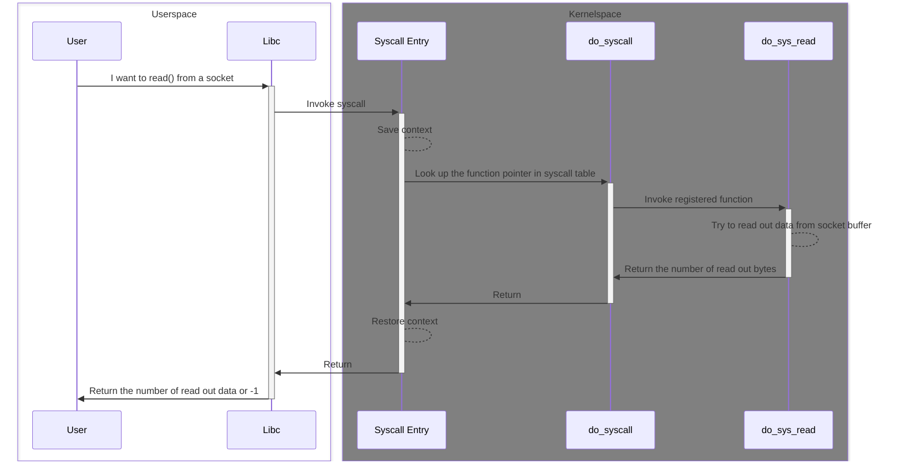

# TL;DR

# What are system calls and why do we need them

System calls are the interface exposed by the Kernel for communication between the user programs and certain Kernel services. These services include but not limited to time, file, and network. They are implemented within the Kernel mainly due to the following reasons: 

* **Reliability**: If you are an advanced system hacker, you may know tricks that allow you to design file system or network stack completely within the userspace. But for regular program developers, it is easier to rely on the trustworthy Kernel to provide these services. For example, the Kernel ensures that when the program attemps to read out something by calling read() on a TCP socket, it shall receive in sequence data if there is any. The correctness is guaranteed by the network system within the Kernel.

* **Portability**: The portability here are referring to both that across different operating system and between different release verson of one system.

* **Security**: Since the services are provided by the monolithic Kernel and shared among all programs within the system, it is vital to protect the Kernel and benign applications from being contaminated by any destructive behaviours in a potentially malicious environment.

The fundamental reason of having system calls is that programs running in the user mode need to leverage these services which require higher level of priviledge. 

<!-- (a) These services are shared by all processes in the operating system and  The program running in user space need to leverage the services provided by the Kernel, and (b)  -->

# How do system calls work

I always explain how system calls work to people as trying to order food in a foreign country. Imagine you walk into a restaurant, starving, but unfortunately are only capable of speaking the language at the beginner level on Duolingo. What do you do? Obviously it is too late for you to learn how to speak another language. So you pick up the menu, and thank God that the owner is considerate enough to assign numbers to each item. You decide to order #5 — whatever that is — and signal the waiter. He approaches and you say “#5 please” using your limited language skill and pray that you get it right. After some time he comes back with the right meal — luckily — and hopefully it fits your appetite. 

This is basically what happens when a program tries to invoke a system call, where the program is the nervous customer, the Kernel is the waiter, and the system call table is the menu with numbers on items.

# Want to know more about how system calls are implemented?

