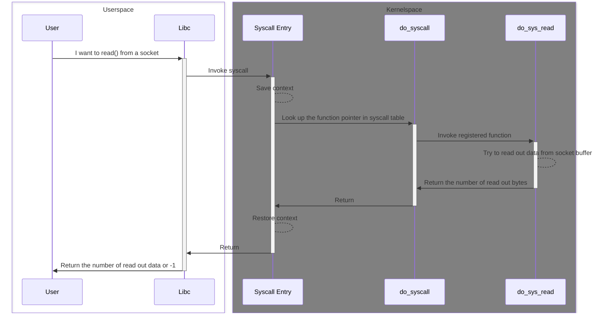

```mermaid
sequenceDiagram
    box Userspace
    participant User
    participant Libc
    end
    box grey Kernelspace
    participant Syscall Entry
    participant do_syscall
    participant do_sys_read
    end
    User->>+Libc: I want to read() from a socket
    Libc->>+Syscall Entry: Invoke syscall #1
    Syscall Entry-->Syscall Entry: Save context
    Syscall Entry->>+do_syscall: Look up the function pointer in syscall table
    do_syscall->>+do_sys_read: Invoke registered function
    do_sys_read-->do_sys_read: Try to read out data from socket buffer
    do_sys_read->>-do_syscall: Return the number of read out bytes
    do_syscall->>-Syscall Entry: Return
    Syscall Entry-->Syscall Entry: Restore context
    Syscall Entry->>-Libc: Return
    Libc->>-User: Return the number of read out data or -1
```
